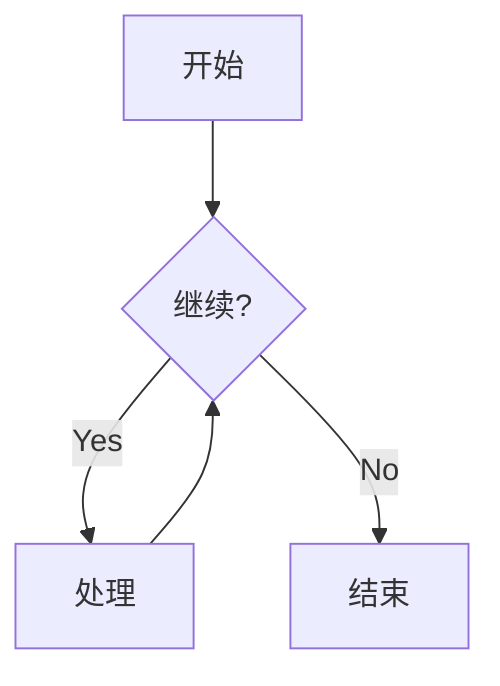
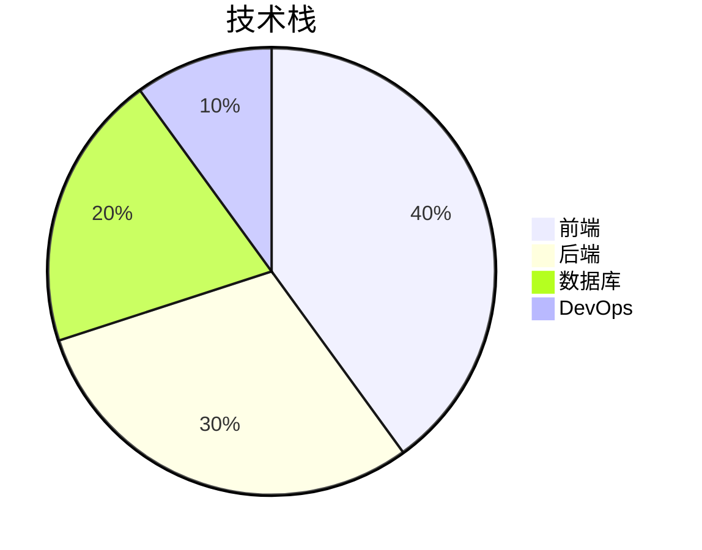

## 文本格式

普通正文，**粗体**，*斜体*，~~删除线~~，`行内代码`。

## 列表

### 无序列表

- 项目一
- 项目二
- 项目三

### 有序列表

1. 第一步
2. 第二步
3. 第三步

## 代码块

```js
function greet(name) {
  return `Hello, ${name}!`;
}
```

## 表格

| 名称 | 类型 | 默认值 |
|------|------|--------|
| title | string | — |
| tags | string[] | [] |

## 图表 (Mermaid)





## 引用

> 这是一段引用文本。

## 链接

[Astro 文档](https://docs.astro.build)

## 图片


